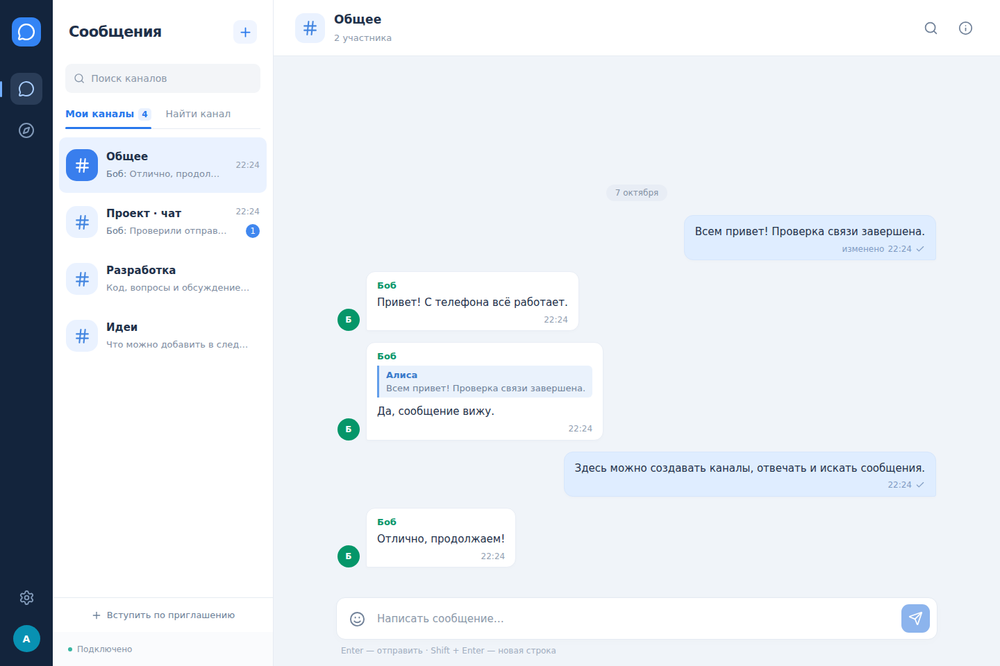

# Relay Chat

Учебный чат с каналами для **браузера, Android/iOS и десктопа**. Один сервер и общие аккаунты для всех устройств. Проект реализован индивидуально.



## Что работает

- Регистрация, вход, выход, сохранение сессии; имя и описание профиля.
- Публичные и приватные каналы, поиск каналов, вступление, приглашение по коду.
- Сообщения в реальном времени, история с постраничной загрузкой, непрочитанные.
- Ответ на сообщение, изменение и удаление своих сообщений, эмодзи.
- Индикатор «печатает», состояние подключения, восстановление истории после отключения.
- Повторная отправка не создаёт дубликат: клиент использует один `clientId` при повторе.
- Поиск по сообщениям: PostgreSQL; Elasticsearch подключается отдельным compose-файлом.
- Адаптивный интерфейс, сохранение черновика отдельно для каждого канала.
- Нагрузочный генератор с проверкой доставки и p50/p95/p99.

Минимальный профиль уже реализован. Векторная база и семантический поиск относятся к следующему этапу; план — [docs/ARCHITECTURE.md](docs/ARCHITECTURE.md).

## Стек

| Часть | Технологии |
|---|---|
| Сервер | Node.js, Express 5, Socket.IO 4 |
| Браузер | React, TypeScript, Vite |
| Мобильное приложение | Ionic React + Capacitor, нативные проекты Android и iOS |
| Десктоп | Electron, Windows/Linux/macOS |
| База | PostgreSQL на VM; PGlite — тот же движок PostgreSQL в локальном режиме |
| Обмен между экземплярами | Redis + Socket.IO Redis adapter |
| Поиск | PostgreSQL, опционально Elasticsearch |
| VM | Docker Compose + Nginx |

Точные версии зависимостей закреплены в `package-lock.json`. Рекомендуемая среда — **Node.js 24 LTS**, Git, VS Code или Cursor.

## Быстрый запуск на компьютере

Для проверки веб-версии нужны только Node.js и интернет для первой установки зависимостей. Docker, отдельный PostgreSQL и `.env` не обязательны.

```bash
npm ci
npm run build
npm start
```

Открыть **http://localhost:3001**. Создать аккаунт на вкладке «Регистрация». Второй аккаунт открыть в другом браузере или приватном окне: сессии внутри одного браузерного профиля общие.

**Windows:** после установки Node.js можно запустить `scripts/start-windows.cmd` двойным щелчком; затем открыть адрес из консоли. **Linux/macOS:** `bash scripts/start-local.sh`.

Локальная база сохраняется в `data/relay`. Перезапуск не удаляет аккаунты и сообщения. Для чистого старта остановите сервер и удалите только этот каталог, если данные больше не нужны.

Для разработки с автоматическим обновлением:

```bash
npm run dev
```

Интерфейс: **http://localhost:5173**, API: http://localhost:3001. Прокси Vite направляет запросы и WebSocket на API.

## Развёртывание на виртуальной машине по IP

Подойдёт Ubuntu 22.04/24.04, Docker Engine и Compose plugin. Для базовой конфигурации предусмотрите 2 CPU и 2 GB RAM; с Elasticsearch — 4 GB RAM. Это стартовая конфигурация для учебной демонстрации, её предельную нагрузку нужно измерять на самой VM.

Перенесите репозиторий на VM. Если доступ к VM идёт через учебную сеть, используйте её IP. Выполните, заменив пример на адрес своей VM:

```bash
bash scripts/deploy-vm.sh 192.168.1.50
```

Скрипт создаёт `.env` со случайным паролем PostgreSQL, добавляет IP в разрешённые адреса клиентов и запускает контейнеры. Доступ: **http://192.168.1.50:8080**. На VM/firewall и в панели провайдера должен быть открыт TCP **8080**. Для хостовой VM с NAT нужен проброс порта, либо сетевой адаптер в режиме bridge.

С другой машины проверьте:

```bash
curl http://192.168.1.50:8080/api/health
```

В ответе ожидаются `"status":"ok"`, `"database":"postgres"`, `"realtime":"redis"`.

Телефон и десктопное приложение подключаются **к тому же адресу**, который вводится на экране входа в «Адрес сервера». `localhost` на телефоне означает сам телефон; нужен IP компьютера/VM. Устройства должны иметь сетевой доступ к VM.

Команды сопровождения:

```bash
docker compose ps
docker compose logs --tail=100 api
docker compose restart api
bash scripts/backup.sh
docker compose down
```

`down` сохраняет том PostgreSQL. `down -v` удаляет данные — для обычного завершения его не используйте. Резервная копия находится в `backups/`; восстановление: `gzip -dc backups/ИМЯ.sql.gz | docker compose exec -T postgres psql -U relay relay`.

Второй аргумент скрипта задаёт другой порт: `bash scripts/deploy-vm.sh 192.168.1.50 80`.

### Elasticsearch

Сразу запустить с поисковой инфраструктурой:

```bash
bash scripts/deploy-vm.sh 192.168.1.50 8080 --search
```

Если Elasticsearch добавляется к уже работающему проекту:

```bash
docker compose -f compose.yaml -f compose.search.yaml up -d --build --wait
docker compose -f compose.yaml -f compose.search.yaml exec api npm run search:reindex -w apps/server
```

Поисковый индекс обновляется асинхронно. После простоя или потери очереди его можно полностью пересобрать из PostgreSQL. При сбое поиска сервер использует SQL. Базы и Redis не публикуют свои порты наружу; отключённая авторизация Elasticsearch допустима здесь только внутри закрытой сети compose.

Для всех следующих команд управления поисковым стеком используйте те же два `-f` параметра, в том числе для `down`. Иначе контейнер Elasticsearch не будет включён в операцию.

## Десктопное приложение

Для разработки:

```bash
npm run build
npm run desktop
```

Сервер должен быть запущен отдельно. В окне Relay Chat введите `http://localhost:3001` для локального сервера или адрес VM.

Сборка на текущей ОС:

```bash
npm run dist -w apps/desktop
```

Результат — `release/desktop/`. Windows: portable `.exe` и установщик NSIS; Linux: AppImage/deb; macOS: dmg. Для выпусков используется GitHub Actions, см. ниже. Неподписанные сборки предназначены для учебной демонстрации.

Переносимая Windows-сборка из поставки распаковывается целиком: запускайте `Relay Chat.exe` внутри папки, сохраняя лежащие рядом файлы.

## Мобильное приложение

Это нативная оболочка Capacitor со встроенным клиентом, а не страница, загружаемая с удалённого сайта. Адрес API выбирается при входе.

### Android

Нужны Android Studio, **JDK 21**, Android SDK Platform **36**, Build Tools **35.0.0** (версия по умолчанию Android Gradle Plugin) и **36.0.0**. Native-проект уже находится в `apps/web/android`.

```bash
npm ci
npm run build
npm run mobile:sync
npm run mobile:android
```

Android Studio откроет проект: запустите его на телефоне/эмуляторе, либо выполните Gradle:

```bash
cd apps/web/android
./gradlew assembleDebug
```

В Windows: `gradlew.bat assembleDebug`. APK: `apps/web/android/app/build/outputs/apk/debug/app-debug.apk`. Debug APK подписан учебным debug-ключом и подходит для ручной установки, не для магазина приложений.

На физическом телефоне укажите IP VM/компьютера. В Android Emulator `10.0.2.2` обычно указывает на хостовую машину; если сервер именно на хосте, добавьте `http://10.0.2.2:3001` в `ALLOWED_ORIGINS` при необходимости подключения веб-клиентов с этого адреса. Origin нативного Android-клиента — `http://localhost` и уже разрешён.

### iOS

Нужны macOS и Xcode. Проект: `apps/web/ios/App/App.xcodeproj`, Swift Package Manager. Выполните `npm run build`, `npm run mobile:sync`, `npm run mobile:ios`; запустите схему `App` в симуляторе. Для установки на физический iPhone требуется настроить Apple signing team. CI собирает приложение для симулятора без аккаунта Apple.

Учебная конфигурация Android/iOS допускает HTTP-сервер по IP. Для публикации в интернете используйте HTTPS и уберите исключения cleartext/ATS.

## Проверки и имитация нагрузки

```bash
npm run check
npx playwright install chromium
npm run test:e2e
```

`check`: TypeScript, серверные проверки и production-сборка интерфейса. `test:e2e`: два настоящих браузерных контекста, один с размером телефона; доставка, правки, ответы, каналы, поиск, reconnect, сохранение сессии и защита от HTML в сообщениях. Тест запускает свою временную базу и сервер, рабочие данные не меняет.

Для интеграционных серверных проверок с подготовленными отдельными PostgreSQL/Redis: задайте `TEST_DATABASE_URL`, `TEST_REDIS_URL` и запустите `npm test`. Это **тестовая база**; в ней будут созданы пользователи и сообщения.

После запуска своего сервера:

```bash
npm run test:load -- --url=http://localhost:3001 --users=10 --messages=100 --concurrency=8 --rate=30
```

Это **100 сообщений на каждого** из 10 пользователей, то есть 1000 сообщений всего. `--rate` — суммарные запросы отправки в секунду; `--concurrency` — одновременно работающие отправители. Тест создаёт свой канал, проверяет HTTP и WebSocket, оставляет сообщения для просмотра, завершает тестовые сессии. Можно сохранить результат: `--output=load-result.json`.

Для VM замените URL на её адрес. Большой тест, например 10 000 сообщений: `--users=10 --messages=1000 --rate=30`. Для более интенсивной отправки измените `MESSAGE_RATE_LIMIT` и `API_RATE_LIMIT` в `.env`, пересоздайте `api`; код 429 означает срабатывание защиты, а не потерю сообщения базой.

Метрики: `/api/metrics`. Сравнивайте долю ошибок, потерянную доставку, p95/p99 и ресурсы VM. Локальные результаты поставки приведены в [docs/VALIDATION.md](docs/VALIDATION.md); они не определяют предельную производительность VM.

## GitHub, README и ветки для сдачи

В поставке есть Git bundle с историей и ветками. Если проект распакован из архива, историю можно восстановить в **новую папку**:

```bash
git clone relay-chat.bundle relay-chat-git
cd relay-chat-git
git branch -a
```

Ветки: `main` — готовая версия, `develop` — интеграция, `feature/server`, `feature/clients`, `feature/infrastructure` — этапы реализации. Ветки сохранились в bundle; они могут отображаться как `remotes/origin/...` после клонирования. Для локальной ветки: `git checkout develop`.

Создайте **пустой** репозиторий `relay-chat` в своём GitHub, без автоматически добавленных README/лицензии, затем замените URL:

```bash
git remote set-url origin https://github.com/YOUR_LOGIN/relay-chat.git
git push -u origin main
git push origin origin/develop:develop origin/feature/server:feature/server origin/feature/clients:feature/clients origin/feature/infrastructure:feature/infrastructure
```

Если `develop` уже создан локально, можно использовать `git push -u origin develop`. Не загружайте `.env`, базы, `node_modules` и приватные ключи; они исключены через `.gitignore`.

GitHub Actions автоматически проверяет `main`/`develop`. В **Actions → Build applications → Run workflow** собираются Android APK, Windows/Linux/macOS и iOS simulator; готовые файлы доступны в artifacts. Для сборки по версии можно создать и отправить тег `v1.0.0`. Сам GitHub и VM требуют доступа владельца аккаунта/сервера; поставка не содержит выдуманных адресов развёртывания.

## Структура

```text
apps/server/       Express API, Socket.IO, SQL-схема, тесты
apps/web/          React UI, Ionic, Android и iOS проекты
apps/desktop/      Electron, защищённое окно и упаковка
infra/            Nginx
scripts/          Запуск, VM, backup, нагрузка
tests/            Браузерная проверка
docs/             Архитектура, API, демонстрация, результаты
.github/workflows CI и сборки приложений
```

Сценарий показа преподавателю: [docs/DEMO.md](docs/DEMO.md). План: [PLAN.md](PLAN.md). API: [docs/API.md](docs/API.md).

## Границы первого задания

Сообщения текстовые; личные диалоги, файлы, звонки, push-уведомления и векторный поиск не входят в первую версию. Галочки у своих сообщений означают сохранение на сервере, не прочтение всеми участниками. Ограничение тела — 4000 символов. Сессия по умолчанию действует 7 дней. Веб-токен хранится локально на устройстве; пароли — только как scrypt-хеши, сервер хранит хеши случайных токенов.

Серверное приложение здесь имеет один экземпляр в Compose. Для масштабирования на несколько процессов уже предусмотрен Redis adapter; при использовании polling потребуется sticky routing. Подробности и текущие ограничения — в архитектуре.
