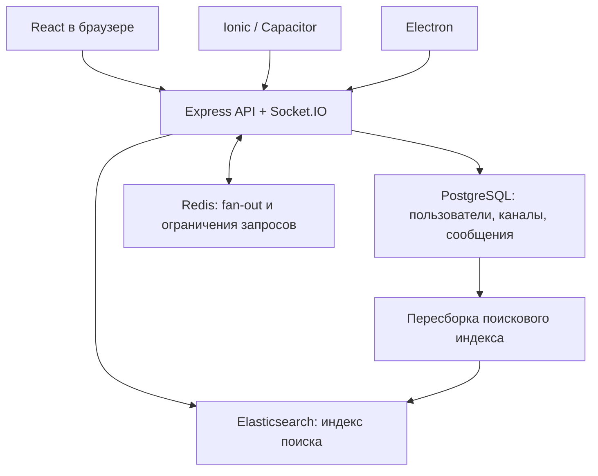

# Архитектура

## Поток сообщений

1. Клиент создаёт UUID `clientId` и отправляет `POST /api/channels/:id/messages` с текстом и bearer-токеном.
2. Сервер проверяет сессию, участие в канале, длину текста и принадлежность сообщения для ответа.
3. PostgreSQL сохраняет запись. Уникальный ключ `(channel_id, author_id, client_id)` защищает от дублей, в том числе при конкурентной отправке.
4. Только после успешной записи сервер отправляет `message.created` в комнату канала и возвращает сохранённое сообщение клиенту.
5. Redis adapter доставляет события подписчикам других процессов. Сообщения хранятся в PostgreSQL, Redis не является историей чата.
6. Клиент заменяет локальное pending-сообщение настоящей записью по `clientId`. При ошибке кнопка повторной отправки использует прежний UUID.

## Модель данных

| Таблица | Назначение |
|---|---|
| `users` | UUID, уникальный username, имя, bio, цвет, scrypt-хеш |
| `sessions` | SHA-256 случайного токена, пользователь, срок действия |
| `channels` | Название, описание, public/private, владелец, случайный код приглашения |
| `memberships` | Участник канала, последний прочитанный ID |
| `messages` | BIGSERIAL ID, канал, автор, clientId, текст, ответ, даты правки/удаления |
| `schema_versions` | Версия схемы |

Индексы: `(channel_id,id DESC)` для истории, уникальный ключ отправки, пользователь в memberships, GIN для будущего полнотекстового запроса. Текущий SQL-поиск использует экранированный `ILIKE` для ожидаемого поиска по части русскоязычного текста. При большой базе полезно включить Elasticsearch либо перейти на `pg_trgm`/полнотекстовый поиск; текущий GIN не ускоряет `ILIKE`.

ID сообщения передаётся строкой, чтобы BIGINT не терял точность в JavaScript. UUID пользователя и канала проверяется до SQL. Все параметры запросов передаются отдельно от SQL-текста.

## Доступ и сессии

- Публичность канала означает возможность найти его и вступить. История доступна участникам.
- Приватный канал не появляется в каталоге. Вступление возможно по случайному коду, который получает владелец.
- Изменять/удалять можно только своё сообщение в канале, где пользователь ещё состоит.
- Авторизация проверяется и в HTTP, и при подключении Socket.IO. Выход отзывает сессию и отключает её сокеты.
- Истёкшие сокеты отключаются максимум через минуту; HTTP проверяет срок при каждом запросе.
- Пользовательские сообщения рендерятся React как текст. HTML не исполняется. CSP запрещает сторонние скрипты.
- Electron не предоставляет Node, shell или filesystem в renderer; включены contextIsolation и sandbox, внешняя навигация запрещена.
- CORS/Origin проверяет разрешённые адреса, включая handshake WebSocket. Origin нативных клиентов постоянный; IP VM относится к веб-клиентам.

Учебная демонстрация по HTTP в доверенной сети требует открытого порта VM. Для внешнего сервера нужен TLS; адрес HTTPS задаётся в клиентах. Файлы `.env` и резервные копии содержат приватные данные и не коммитятся.

## История, reconnect и нагрузка

История: курсор `before` или `after`, размер страницы до 100, сортировка по ID. OFFSET не используется. Socket.IO Redis adapter не предоставляет гарантированную историю/replay событий; после переподключения клиент загружает актуальные последние сообщения через HTTP. Более старые сообщения всегда доступны через пагинацию.

Метки прочтения синхронизируются по аккаунту между устройствами и отмечаются, когда переписка видима и пользователь находится внизу истории. «Печатает» временное и исчезает по TTL.

Один процесс с PGlite предназначен для разработки. На VM используется PostgreSQL pool на 20 соединений. Redis используется для межпроцессного realtime и общих HTTP rate limits. Чтобы масштабировать API, сначала добавьте реплики и балансировщик; для Socket.IO polling нужны sticky sessions либо только WebSocket. Compose по умолчанию запускает одну реплику; горизонтальное масштабирование здесь не проверялось.

Поисковая очередь пока в памяти процесса, ограничена 20 000 элементами. Elasticsearch — дополнительный индекс, а PostgreSQL — источник истины. При остановке очереди/сбое выполняйте `search:reindex`. Для следующего этапа надёжной индексации стоит заменить очередь на transactional outbox в PostgreSQL с отдельным worker. Текущий поиск может отражать изменения с задержкой.

## Расширение на следующих занятиях

1. Более подробный профиль: аватар, настройки, timezone; уже есть отдельные `/api/me` и `users`.
2. Миграции: новые SQL-файлы с отдельными версиями и явными ALTER; текущая первая версия создаётся при старте под PostgreSQL advisory lock.
3. Векторный поиск: PostgreSQL + `pgvector`, таблица `message_embeddings(message_id, model, vector, source_version)`, worker расчёта embedding, endpoint поиска с проверкой memberships.
4. Индексация: transactional outbox, повтор с задержкой, пересборка, контроль отставания индекса.
5. Нагрузка: раздельно оценивать отправку, fan-out, историю и поиск; увеличить объём БД, число соединений и клиентов, исследовать p95/p99 и CPU/RAM/IO.

Векторы и модель embeddings не вычисляются в текущей поставке. Внешний API модели, ключи и новые расходы для первой версии не нужны.
